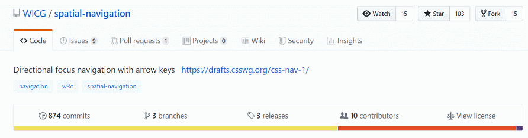
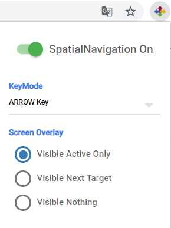
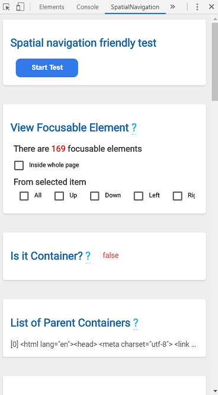

# spatial-navigation-chrome-extension

**Written**: 2019-01-02, **Updated**: 2019-08-29

**Spatial-navigation-chrome-extension** enable spatial navigation on any websites using [spatial-navigation-polyfill](https://github.com/WICG/spatial-navigation/tree/master/polyfill)
- 

**Spatial Navigation** provides a processing model and standards APIs for directional(top/left/bottom/right) focus navigation using arrow keys. ([Learn More](https://wicg.github.io/spatial-navigation/))

```
Note:
This extentension is based on spatial-navigation polyfill from develop branch.
It is latest version, but there are some difference with Spec.
```
## Features
### 1. Spatial Navigation
- Enable Spatial Navigation
- Show Spatial Navigation Info in DevTool (F12 / ⌥ +⌘+I)
- Change settings in popup menu

### 2. Popup
1. On / Off Spatial Navigation
2. Change Key mode (ARROW / SHIFTARROW)
3. Choose wheter to show candidates in 4 directions)

- 

### 3. Devtool
1. Focusable Element
: Show number of all focusable element inside whole page
: Use checkbox, you can see (1) whole focusable element inside web page (2) candidate elements of spatial navigation from current focused element to all and each 4 directions
2. Is it container?
: Whether current element is container or not
3. Next Spatnav Search
: Show optimal candidate of 4 directions from current element (in specific container)
4. Next Target
: Show optimal candidate of 4 directions from current element (show undefined if scrollable)
5. Focusable Areas
: Show focusable child elements from current element
6. Next Candidates
: Show all candidates list of 4 directons from current element (show current element if scrollable)
7. List of Containers
: List of containers from parent of current element to topmost container

- 

## How to install
1. Clone the repository `git clone https://github.com/WICG/spatial-navigation.git`.
2. Using chrome, navigate to `chrome://extensions`.
3. Turn on the **Developer mode**.
4. Click **LOAD UNPACKED** and select the `tools/chrome-extension` directory.

## Manual
### 1. PopUp
1. Click the toolbar icon

### 2. DevTool
1. Click the SpatialNavigation tab of developer's tool(F12 / ⌥ +⌘+I).
2. You can see the information of Spatial Navigation on the tab. Also, the information is changed as the focusing moves.


## Acknowledgement

We would like to express appreciation to below students who initially developed this extension.

- jisk984@snu.ac.kr
- amorphysics@snu.ac.kr
- aeridh@naver.com
- maheu@snu.ac.kr
- sunnyday0208@naver.com

### Initial repository
- https://github.com/lgewst/snu-chrome-extension-1
- https://github.com/lgewst/snu-chrome-extension-2
